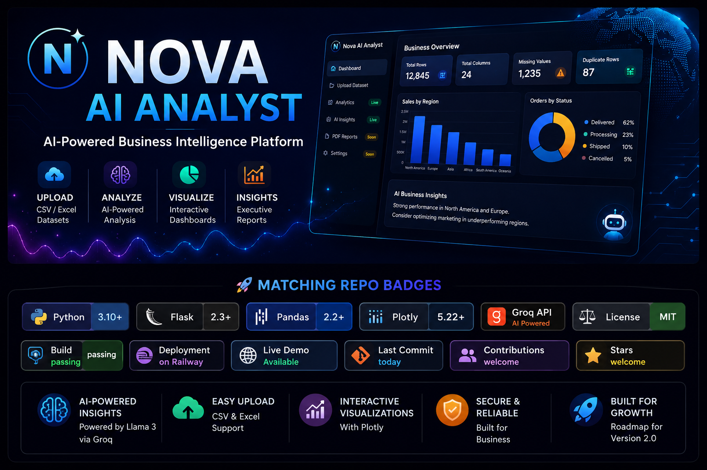

<p align="center">



</p>

# 🚀 Nova AI Analyst Web

> AI-powered Business Intelligence platform that transforms CSV and Excel datasets into executive-level business insights using Large Language Models.

🌐 **Live Demo**

https://web-production-f284c.up.railway.app/

---

## 📖 Overview

Nova AI Analyst Web is an AI-powered Business Intelligence application built to help businesses quickly understand their datasets without requiring advanced analytics skills.

Simply upload a CSV or Excel file and Nova AI automatically:

- Profiles the dataset
- Calculates key statistics
- Generates executive business insights
- Identifies business opportunities
- Highlights data quality issues
- Creates interactive visualizations

The goal is to make business intelligence accessible through an intuitive web interface powered by AI.

---

## ✨ Features

### 📂 Dataset Upload

- CSV Support
- Excel (.xlsx/.xls) Support
- Automatic validation

---

### 📊 Dataset Profiling

Automatically displays:

- Total Rows
- Total Columns
- Missing Values
- Duplicate Records

---

### 🤖 AI Business Insights

Using Groq LLM, Nova AI generates:

- Executive Summary
- Business Insights
- Data Quality Assessment
- Business Opportunities
- Executive Recommendations
- Executive Conclusion

---

### 📈 Interactive Visualizations

Automatically generated Plotly charts including:

- Bar Charts
- Pie Charts
- Histograms

Charts adapt automatically depending on the uploaded dataset.

---

### 📑 Dataset Preview

Displays the first records of the uploaded dataset inside a responsive interactive table.

---

## 🚧 Coming Soon (Version 2.0)

- 📄 Executive PDF Reports
- 🔐 User Authentication
- 💬 Chat with Your Data
- 📈 Predictive Analytics
- 📉 Forecasting
- 📊 Dashboard Customization
- ☁ Cloud Dataset Storage
- 📤 Power BI Export

---

## 🛠 Tech Stack

### Backend

- Python
- Flask
- Pandas
- Groq API

### AI

- Llama 3 (via Groq)

### Frontend

- HTML5
- CSS3
- Jinja2

### Visualization

- Plotly

### Deployment

- Railway

---

## 📂 Project Structure

```
Nova_AI_Web/
│
├── app.py
├── chart_generator.py
├── requirements.txt
├── Procfile
│
├── nova_ai/
│   ├── llm.py
│   └── prompts.py
│
├── templates/
│   ├── index.html
│   └── dashboard.html
│
├── static/
│   ├── css/
│   └── images/
│
├── uploads/
│
└── reports/
```

---

## 🚀 Installation

Clone the repository

```bash
git clone https://github.com/EdetSimon/Nova-AI-Analyst-Web.git
```

Navigate into the project

```bash
cd Nova-AI-Analyst-Web
```

Install dependencies

```bash
pip install -r requirements.txt
```

Create a `.env` file

```env
GROQ_API_KEY=your_api_key_here
```

Run the application

```bash
python app.py
```

Open

```
http://127.0.0.1:5000
```

---

## 💡 Use Cases

Nova AI Analyst is useful for:

- Business Analysts
- Data Analysts
- Financial Analysts
- Small Businesses
- Sales Teams
- Marketing Teams
- Operations Managers
- Students learning Data Analytics

---

## 🎯 Project Goals

This project demonstrates:

- Full-stack Flask development
- Data analysis automation
- AI integration
- Interactive dashboards
- Business Intelligence workflows
- Production deployment

---

## 🗺 Roadmap

### ✅ Version 1.0

- Dataset upload
- AI insights
- Interactive charts
- Dataset preview
- Railway deployment

### 🚀 Version 2.0

- Executive PDF reports
- Authentication
- AI chat
- Forecasting
- Dashboard customization
- Power BI export

---

## 👨‍💻 Author

**Edet Simon (Alphaa)**

Python Developer | Backend Developer | AI Engineer | Technical Analyst

GitHub:
https://github.com/EdetSimon

LinkedIn:
https://www.linkedin.com/in/edetsimon/

---

## ⭐ Support

If you found this project useful, consider giving it a ⭐ on GitHub.

It helps others discover the project and supports future development.

---

© 2026 Edet Simon. All rights reserved.